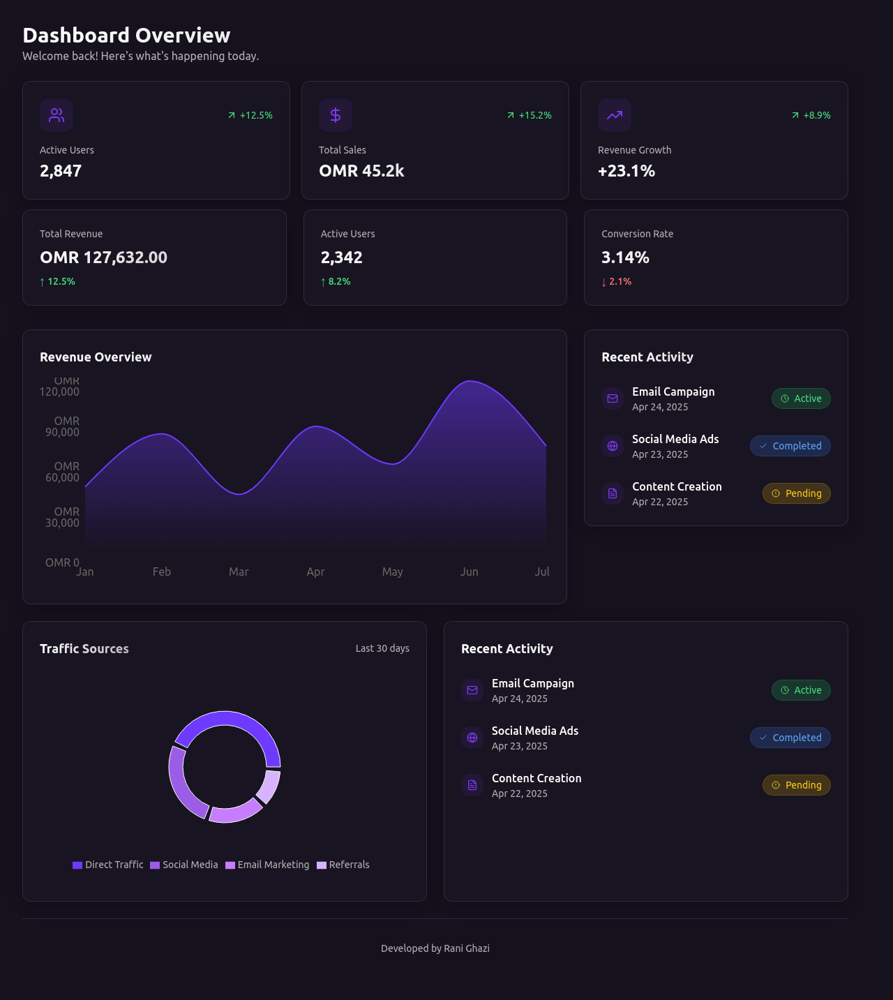

# 📈 Marketing Dashboard Project

## 📊 About the Project

The **Marketing Dashboard** is a responsive web application built to help businesses and marketing teams track their performance in real time. It provides a sleek and modern interface for visualizing:

- 📈 Active users and growth trends
- 💰 Total sales and revenue data
- 🧠 Conversion rates and performance metrics
- 🌐 Traffic sources (Direct, Social Media, Email, Referrals)
- 🗓️ Recent marketing activities like campaigns and ads

This dashboard is ideal for startup founders, digital marketers, and analysts who want a fast, clear snapshot of their key marketing KPIs.

---

## 📷 Project Screenshot



---

## 🌐 Live Demo

**Visit the project**: [https://marketingdashboard.netlify.app/](https://marketingdashboard.netlify.app/)

---

## 🧰 Tech Stack

This project is built using modern frontend technologies:

- ⚡ [Vite](https://vitejs.dev/) — lightning-fast build tool
- ⚛️ [React](https://reactjs.org/) — UI framework
- 🧑‍💻 [TypeScript](https://www.typescriptlang.org/) — typed JavaScript
- 🎨 [Tailwind CSS](https://tailwindcss.com/) — utility-first CSS framework
- 🧩 [shadcn/ui](https://ui.shadcn.dev/) — beautiful, accessible UI components

---

## 🛠️ How to Run the Project Locally

### Prerequisites:
- Node.js and npm installed  
(You can use [nvm](https://github.com/nvm-sh/nvm#installing-and-updating) to manage versions)

### Setup Instructions:

```bash
# 1. Clone the repository
git clone <YOUR_GIT_URL>

# 2. Navigate to the project directory
cd <YOUR_PROJECT_NAME>

# 3. Install dependencies
npm install

# 4. Start the development server
npm run dev
